

<h1> 🐴💫🐎 CARRERA DE CABALLOS 🐎💫🐴 </h1><h3>✨Dónde podras probar tu Suerte ✨</h3>
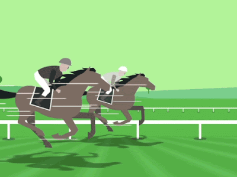
<h6>by skuetoDev</h6>

<h2><code>📖 Dinámica 📖</code></h2>

Para saber de qué va aqui tenemos un 
<a href="https://www.tiktok.com/@crown_ex/video/7224712441635163438">
 video
</a>
 donde se refleja a grandes rasgos el funcionamiento del juego. 
 Cuando aparezca un 🔢 en vez de un 🔷 quiere decir que en la parte de base de datos 🗂️ hay capturas relativas a ese instante del juego.

<h2><code>🕹️ A Jugar! 🕹️</code></h2>
 
🔷 Al empezar el juego nos encontramos en la pantalla de bienvenida, dónde podemos pulsar 

para pasar al menu principal.  
 
 
 
🔷Luego ya en el menu principal seleccionaremos

para avanzar a la siguiente pantalla y comenzar a introducir los datos. 
 
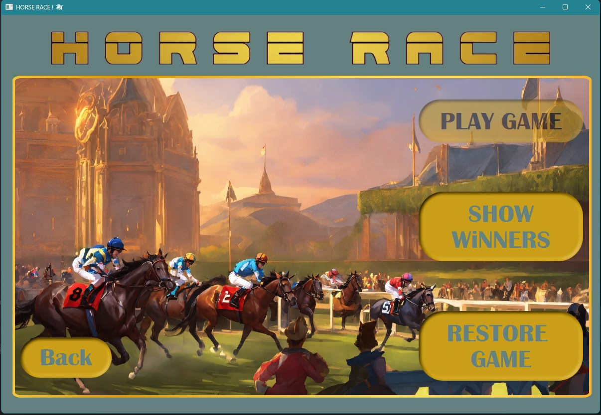 

🔷Ahora elegiremos cuantos jugadores humanos 👨sois ( el resto serán bots🤖). 

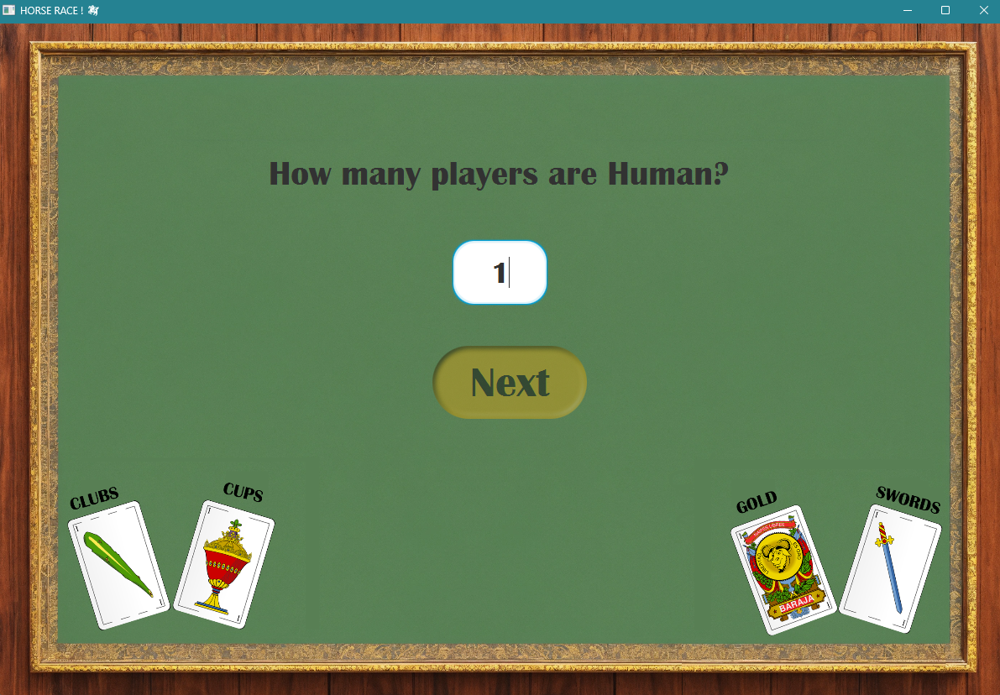 

🔷A continuación introducimos los nombres de usuarios humanos 👨, las apuestas 💵 y el palo de la carta a elegir entre: 
 + 🌿Bastos (*CLUBS*)
 + 🍷Copas (*CUPS*)
 + 🪙 Oros (*GOLD*)
 + ⚔️ Espada (*SWORDS*)

 Pulsamos 
  
 Y a continuación 
 

 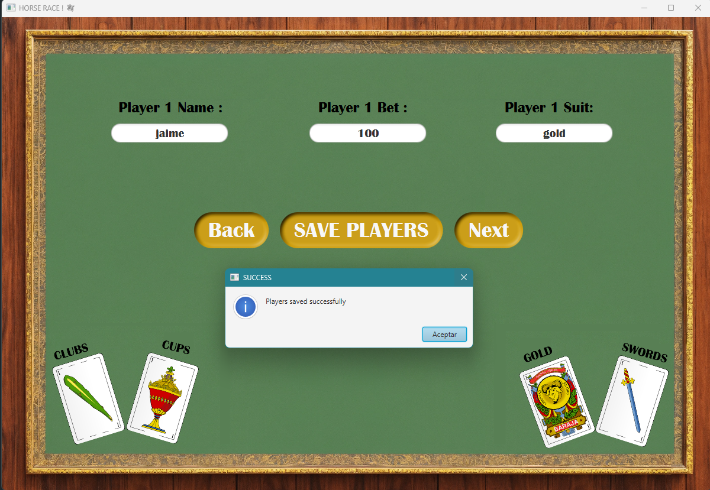 
 
🔷Y nos mostrará toda la información de los 4 jugadores (🤖 &👨) asi como la cantidad que será el premio💰. Pulsamos
 
y comienza el juego! 🚀

 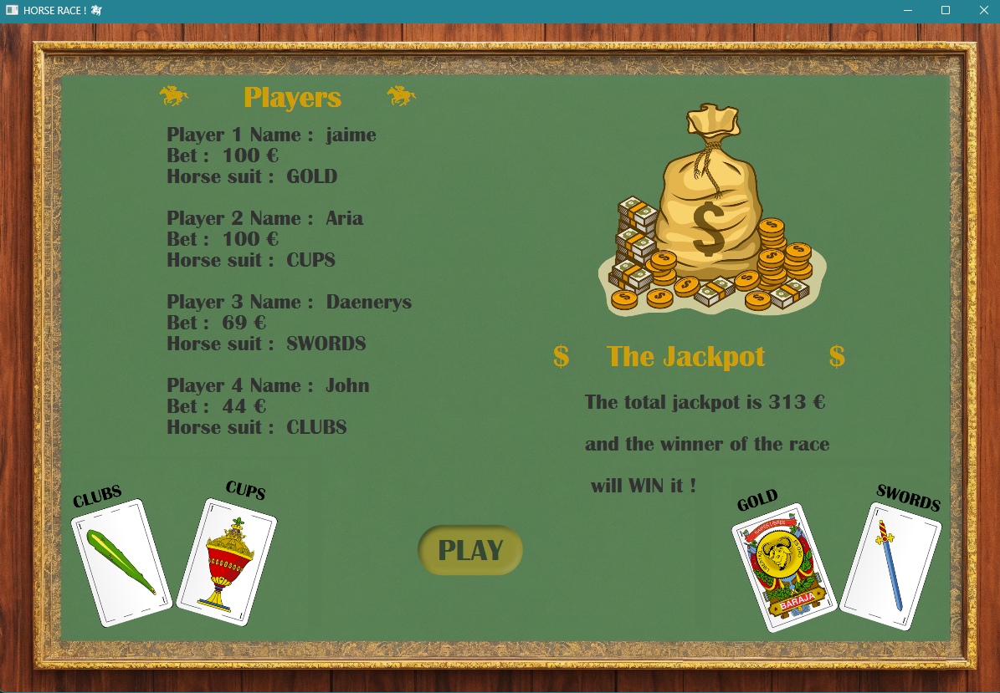 

1️⃣ Cada 🐎 abanzará una posición cuando salga su palo desde el mazo. Exceptuando cada 5 rondas que retrocederá una posición en vez de avanzar.
 
  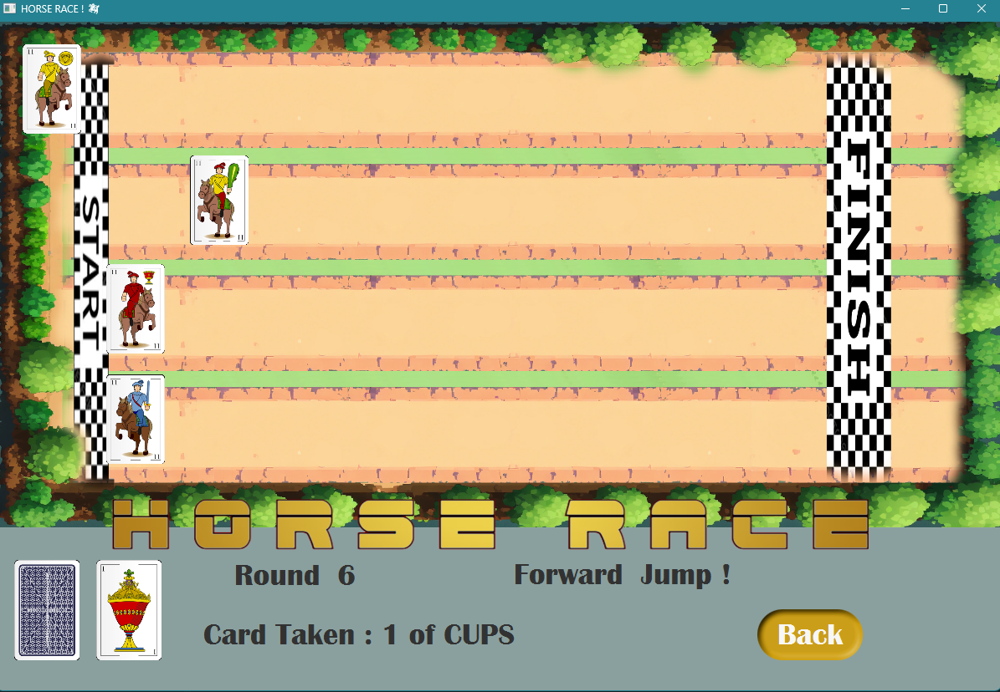 
  
2️⃣En cualquier momento podremos abandonar la partida mediante el botón
 
quedando la partida guardada en cada ronda, por si se interrumpe el programa o salimos mediante el botón mencionado. 

🔷Al salir del juego ( o entrar de nuevo en él), una vez nos encontremos en el menú principal, accedemos a 

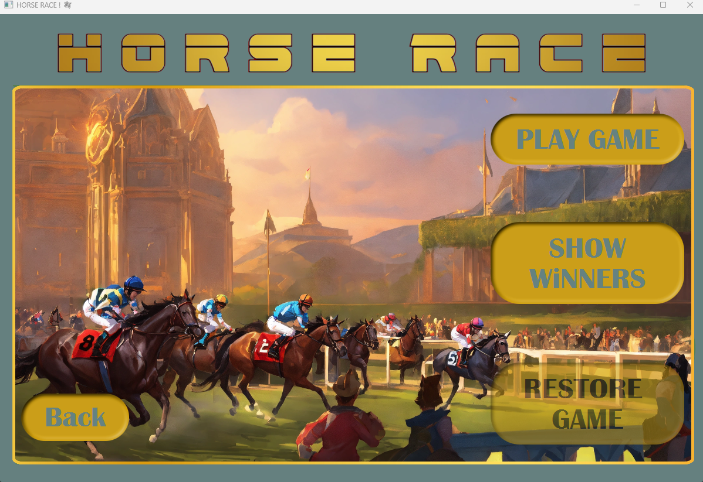 

🔷Cada juego que no haya concluido nos aparecerá en esta pantalla pudiendo restaurarlo en este momento pulsando sobre él. 

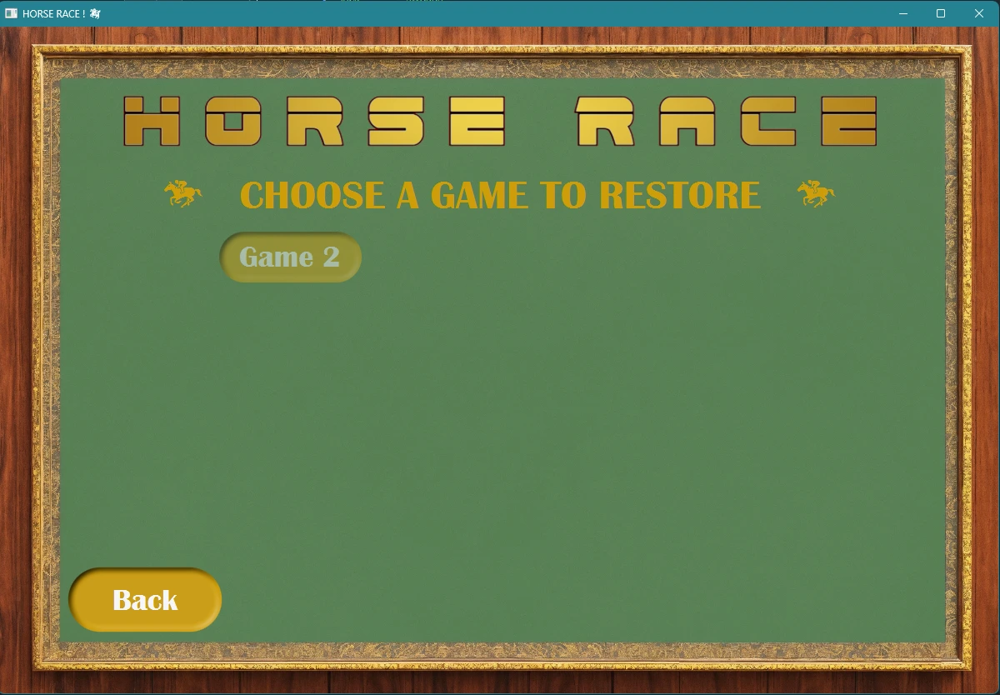 

🔷El primer 🐎 que cruce la linea de meta gana la partida y se nos notificará que caballo ha ganado. Nos aparecerá el botón 
 
para continuar a la siguiente pantalla. 

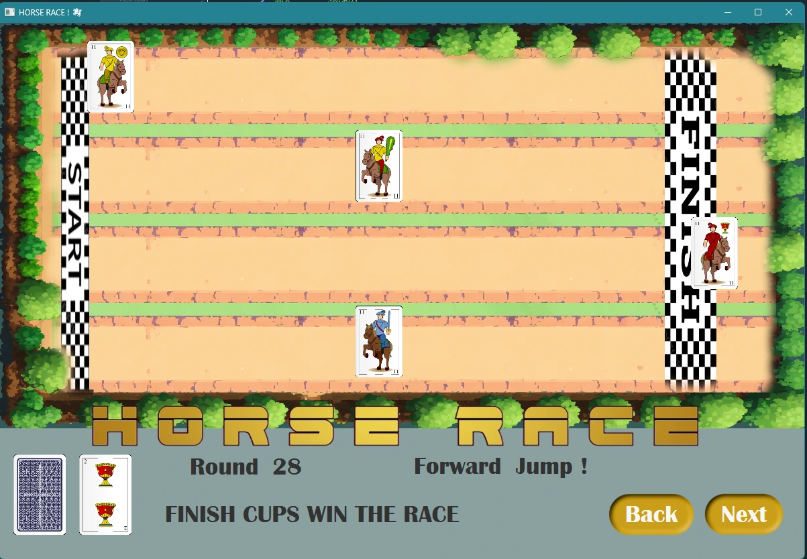 

3️⃣En esta pantalla se nos revelará el nombre del jugador que ha ganado y la cantidad total de dinero ganado 💸 y al pulsar el botón

volveremos al menu principal

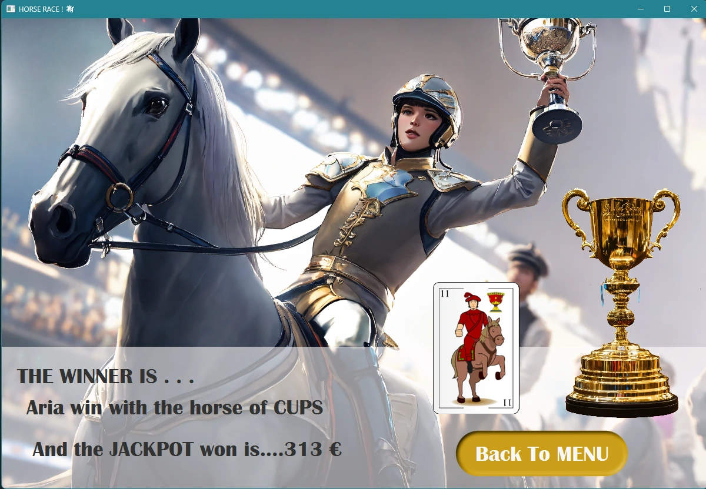 

🔷En el menu principal podemos consultar todos los ganadores pulsando la opción

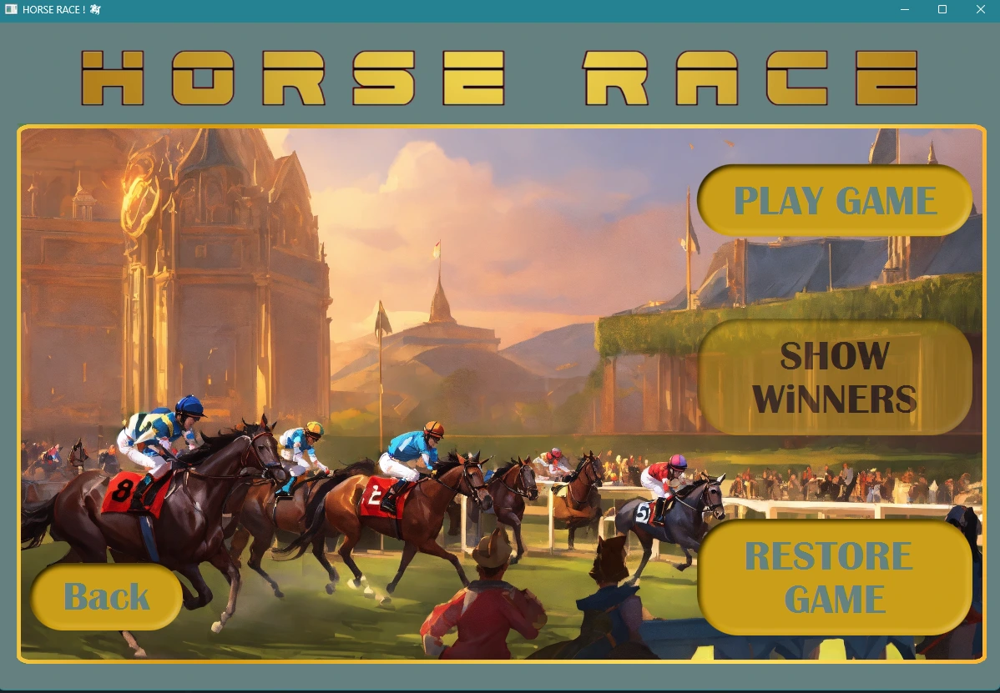 

🔷Que nos dará acceso a un registro de todos los jugadores que han ganado alguna partida 🏆 con la cantidad ganada 💰

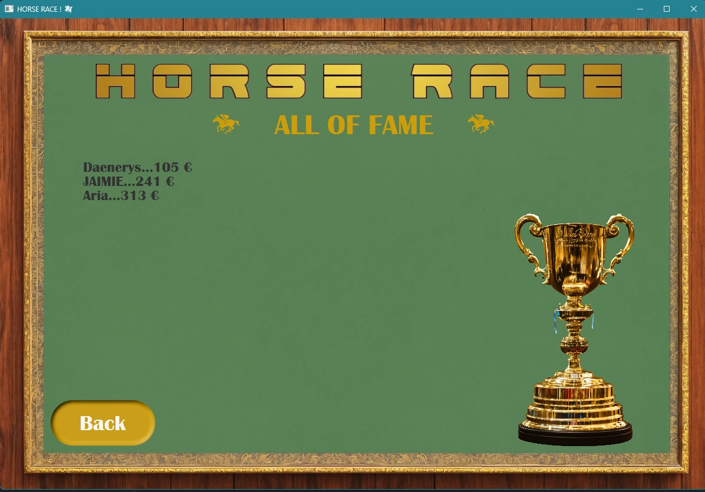

<h2><code>🗄️ Base de Datos 🗄️</code></h2>

1️⃣ Todos los datos de jugadores quedarán registrados por cada partida con un numero de partida 🔢 y en la columa isWinner, por defecto, 0 (no es ganador)

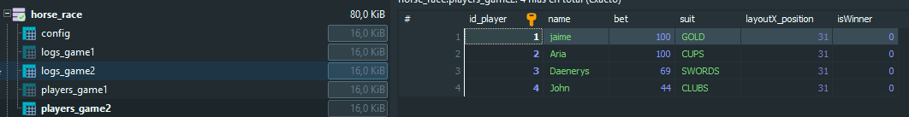 

2️⃣ Cada ronda será guardada en una tabla con el numero de partida correspondiente 🗂️

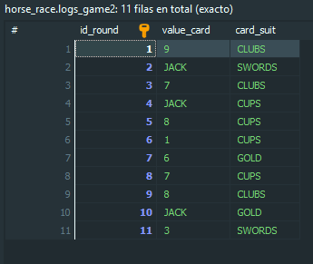 

3️⃣al finalizar la partida queda registrada debidamente en la base de datos. 

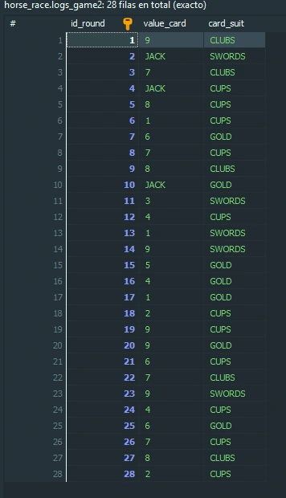 

Y se modifican los datos del juego para indicar que tiene jugador ganador mediante un booleano isWinner (cambiando de 0 a 1)

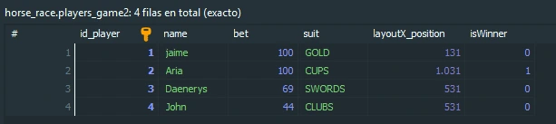 

