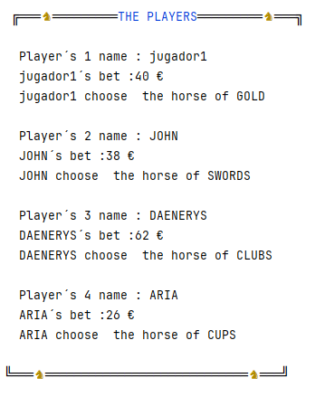

## Bienvenido a...Carrera de caballos 🐎

by mariogarcianavas
#### Donde podras probar tu suerte ✨ 

 Para saber de va aqui tenmos un [video](https://www.tiktok.com/@crown_ex/video/7224712441635163438) donde se refleja a grandes rasgos el funcionamiento.

##### Dinamica
🔷  Una vez abierto el juego debereis elegir cuantos jugadores humanos 👨 sois ( el resto serán bots🤖).
🔷  Hecho esto, ya solo queda:
+ 🔹 Poner de cada uno de vosotros el nombre del jugador. 
+ 🔹 La apuesta que  estais dispuestos a realizar 🤑
+ 🔹 Elegir un palo de la baraja española, a saber entre Bastos🌿(*CLUBS*) Copas🍷 (*CUPS*) Oros 💰(*GOLD*) Espadas⚔️️(*SWORDS*)  

y ya lo teneis... 

A countinuación se mostrará la tabla de jugadores y el juego comienza.

En todo el proceso nos acompañará el croupier 🤵 que es quien nos habla desde el principio y quien ira sacando carta a carta 🃏.  
Cada ronda avanzará el caballo cuyo palo coincida con el de la carta sacada.  
Cada 5º ronda, el caballo no avanzará si no que retrocederá.
Si se agotaran las cartas a sacara, se volverá a barajar.

Ganará 🥇 aquel caballo que llegue al final antes, y   
Aquel jugador que haya elegido ese palo se llevará todo el bote 🏆 (Jackpot) acumulado.
